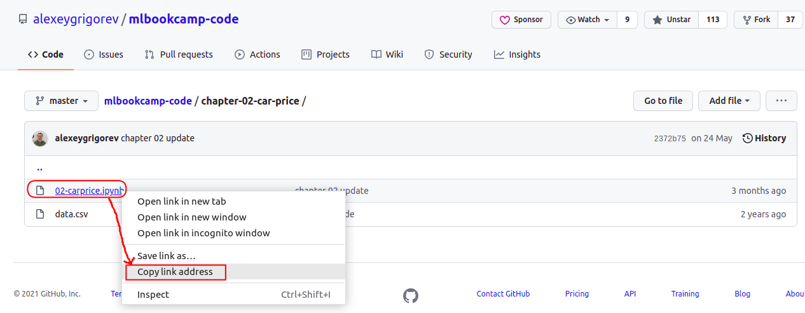
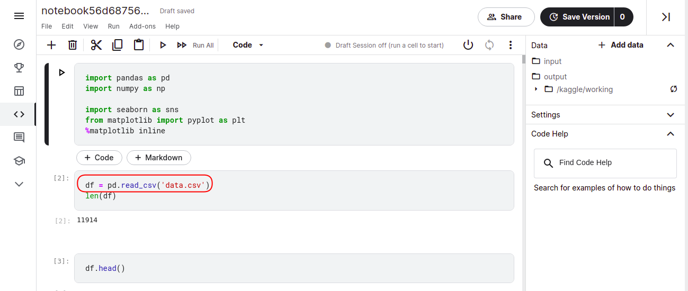
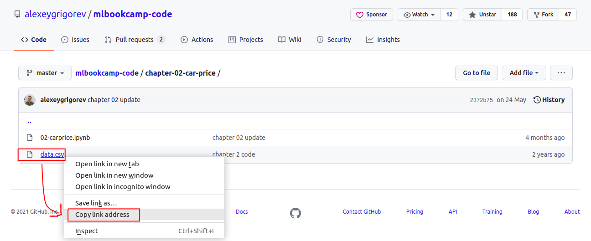
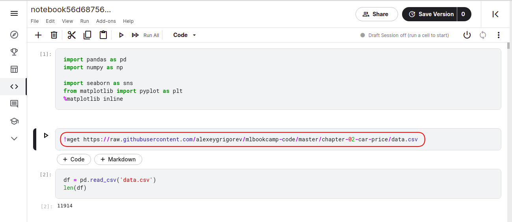

##  Setting up the Environment

In this section, we'll prepare the environment


You need:

* Python 3.9 (note that videos use 3.8)
* NumPy, Pandas and Scikit-Learn (latest available versions) 
* Matplotlib and Seaborn
* Jupyter notebooks
* Later on, we'll need docker and preferably AWS for AWS lambda, Kubernetes, Kserve etc
### Summary

|Name of ML platform| Supports basic ML: Chapter 1-4 | Supports deployment with docker locally: Chapter 5 | Supports docker deployment to Cloud: Chapter 9-11 | Guides |
|-------|-------|-------|-------|------|
|Windows - with Pipenv or Anaconda, Anaconda preferred | :white_check_mark: | :x: | :x: | [Getting started with Anaconda](#anaconda-and-conda)|
|Windows with WSL - with Pipenv or Anaconda, Anaconda preferred| :white_check_mark: | :white_check_mark: | :x: | [Setting up docker with WSL on windows](#ubuntu-on_aws)  
|MacOS (Basically built on a Unix OS, so usually supports whatever Linux supports as Linux is a Unix-like OS)- with Pipenv or Anaconda, Anaconda preferred | :white_check_mark: | :white_check_mark: | :x: | [Getting started with Anaconda](#anaconda-and-conda)
|Ubuntu / Linux - with Pipenv or Anaconda, Anaconda preferred| :white_check_mark: | :white_check_mark: | :x: | [Getting started with Anaconda](#anaconda-and-conda)
|Work completely online & OS independent - Useful for simple ML and light-weight deep learning: Kaggle and Colab| :white_check_mark: | :x: | :x: | [Getting started with Kaggle / Colab](#notebook-services)
|Work in local terminal in any OS, whereas backend is cloud. Esp useful for slow systems that have less than required RAM/GPU - Useful for for AutoML, Advanced ML, heavy-duty deep learning, esp deployment.<br/><br/> Common ML on cloud service providers: AWS, GCP or Azure. Please note that the OS you should select in any cloud platform is Ubuntu/any other Linux disto| :white_check_mark: | :white_check_mark:| :white_check_mark: | [Setting up Ubuntu on AWS](#ubuntu-on_aws)  


## [Anaconda and Conda](anaconda-and-conda)

The easiest way to set up the environment is to use [Anaconda](https://www.anaconda.com/products/individual) or
[Miniconda](https://docs.conda.io/en/latest/miniconda.html).

Anaconda comes with everything we need (and much more). 
Miniconda is a smaller version of Anaconda that contains only Python. 

Follow the instructions on page for installing the correct package for your system.
The site will automatically detect your operating system and suggest the correct package.

* [Anaconda](https://www.anaconda.com/products/individual)
* [Miniconda](https://docs.conda.io/en/latest/miniconda.html#latest-miniconda-installer-links)

If you are using Windows, you can use WSL, but the plain Windows version should work too.

Anaconda is recommended.


### (Optional) Create environment for course

It is a good idea to set up a dedicated environment for the course 

In your terminal (e.g bash for Ubuntu, anaconda command prompt for windows), run this command to create the environment

```bash
conda create -n ml-zoomcamp python=3.9
```

Activate it:

```bash
conda activate ml-zoomcamp
```

Installing libraries

```bash
conda install numpy pandas scikit-learn seaborn jupyter
```

Later in the course you will also need to install XGBoost and Tensorflow,
but we can skip this part for now.

## [Notebook services](notebook-services)

There are services that allow you to host and run notebooks.
Note that notebooks alone are not sufficient for the course and for the deployment modules
you will need to have access to the command line interface with Docker, Python and other libraries installed.

### Kaggle

To use Kaggle to open and run the Jupyter notebooks provided as part of this course do the following:

*Pre-requisites - You need to have an account in Kaggle (it's free) and be logged into Kaggle*

1. Find the URL of the notebook. 
   
   
   
2. To open the notebook in Kaggle, in your web browser launch paste the URL as shown in below example. (*note the additional https://kaggle.com/kernels/welcome?src= before the URL of the notebook*)

   https://kaggle.com/kernels/welcome?src=https://github.com/alexeygrigorev/mlbookcamp-code/blob/master/chapter-02-car-price/02-carprice.ipynb
  
3. Check if the notebook uses any datafile to read data from it. If yes, note the datafile name from the code.- *look for pd.read_csv("somefilename.csv")*. 
   
   
   
4. You need to download the file into Kaggle. For this:

   a. Find the URL of the datafile in github. 
   
   
   
   b. Suppose the URL is https://github.com/alexeygrigorev/mlbookcamp-code/blob/master/chapter-02-car-price/data.csv , you need use the URL to raw file, which will look something like https://raw.githubusercontent.com/alexeygrigorev/mlbookcamp-code/master/chapter-02-car-price/data.csv
   
5. In the notebook opened in Kaggle, add a Code block with the command to download the file - !wget your-datafile-url 

   
   
This way you can start with the exercise using Kaggle


### Google Colab

To use Google Colab to open and run the Jupyter notebooks provided as part of this course do the following:

*Pre-requisites - You need to have a google account (any gmail account) and be logged into that account*

Steps for Google Colab are same as that for Kaggle, except for some changes in Step 2, as explained below.

2. To open the notebook in Google Colab, in your web browser launch paste the URL as shown in below example. (*note the https://github.com/ in the URL of the notebook is replaced by https://colab.research.google.com/github/*)

   https://colab.research.google.com/github/alexeygrigorev/mlbookcamp-code/blob/master/chapter-02-car-price/02-carprice.ipynb


## Cloud

Instead of running things locally, you can use online services or rent a server 

### AWS 

You can rent an instance on AWS:

* [Creating an AWS account](https://mlbookcamp.com/article/aws)
* [Renting an ec2 instance](https://mlbookcamp.com/article/aws-ec2)

#### [Ubuntu on AWS](ubuntu-on-aws)

* [This video](https://www.youtube.com/watch?v=IXSiYkP23zo) shows a complete end-to-end environment configuration for an AWS EC2 instance
* This video was created for another course (MLOps Zoomcamp), so you'll need to adjust it slightly: clone this repo instead of the mlops one
* You can use these instructions for setting up docker with your local Ubuntu or Ubuntu in WSL 


### GCP

Google cloud platform offers $300 in free credits when you sign up.
You can use this for taking the course.


## Navigation

* [Machine Learning Zoomcamp course](../)
* [Lesson 1: Introduction to Machine Learning](./)
* Previous lesson: [The Modelling Step (Model Selection Process)](05-model-selection.md)
* Next lesson: [Introduction to NumPy](07-numpy.md)
